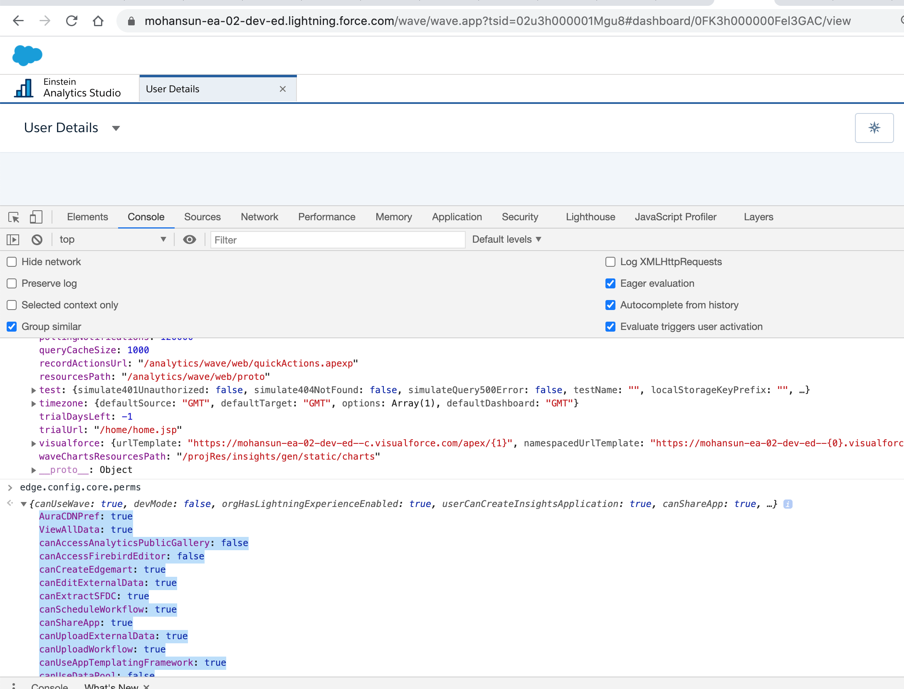

# How to check user perms in EA

- In the browser console check the value of:


```
 edge.config.core.perms
```


- You will see the result similar to this:
```
AuraCDNPref: true
ViewAllData: true
canAccessAnalyticsPublicGallery: false
canAccessFirebirdEditor: false
canCreateEdgemart: true
canEditExternalData: true
canExtractSFDC: true
canScheduleWorkflow: true
canShareApp: true
canUploadExternalData: true
canUploadWorkflow: true
canUseAppTemplatingFramework: true
canUseDataPool: false
canUseDataPrep: true
canUseFullDataPrep: true
canUseSearchSuggestions: true
canUseSentimentAnalysisRecipes: false
canUseWave: true
canUseWaveChatter: true
canUseWavePublishToIoT: false
canUseWaveSparkELT: true
canUseWaveSubscription: false
canViewDataflows: true
canViewWorkflowAndNodes: true
canWriteDataflowViaAPI: true
dataBlendingEnabled: false
devMode: false
isInPortalContext: false
orgCanEmbedInsights: true
orgCanScheduleSubHourly: true
orgHasAnalyticsTrialAccess: false
orgHasCommonCspEnabled: true
orgHasCommonPrmEnabled: true
orgHasComponentsEnabled: true
orgHasCustomChoropleth: true
orgHasDashboardSavedView: true
orgHasDevPreviewConnectors: false
orgHasEAWriteConnectors: false
orgHasEDEnabled: true
orgHasEDOnCorePilot: true
orgHasEDWithEinsteinMetadataEnabled: true
orgHasEclairNGAPI: true
orgHasEclairNGApi: true
orgHasEdiEnabled: true
orgHasExternalDataConnectors: true
orgHasFavorites: true
orgHasFirebirdEditor: false
orgHasInaccessibleHelpResource: false
orgHasInsights: true
orgHasInsightsEnabled: true
orgHasLightningExperienceEnabled: true
orgHasLiveConnectors: false
orgHasMetalyticsAPI: false
orgHasMulesoftConnectors: true
orgHasNotifications: true
orgHasOnboardingCustomerResourceAccess: false
orgHasOnboardingExperienceVideoAccess: true
orgHasPilotConnectors: false
orgHasReplicationEnabled: true
orgHasTestConnectors: false
orgHasWatchlistEnabled: false
orgHasWaveCommunityAccess: true
orgHasWaveCustomFiscalEnabled: false
orgHasWaveGlobalSearch: false
orgHasWaveIsYearEndFiscalYear: false
orgHasWaveNLQ: true
orgHasWaveNullDimensionSAQLEnabled: false
orgHasWaveNullMeaEnabled: false
orgHasWaveQueryReserved6: false
orgHasWaveQueryReserved8: false
orgHasWaveSharing: false
orgHasWaveSharingDescriptors: false
orgHasWaveTimeZoneEnabled: false
orgHasWaveTrendEmbedDashboards: false
orgHasWaveTrendRecommendations: false
orgHasWaveTrendReports: false
orgHasWaveTrendReportsApexCallback: false
orgHasWriteConnectorsGA: false
orgHasWriteConnectorsPilot: false
orgUseWaveAuraPage: false
showAppTemplateJsonEditor: false
showSubscriptionRunNow: false
userCanAccessReplication: true
userCanAccessSDK: true
userCanAddAnalyticsRemoteConnections: true
userCanAddNotificationRecipients: true
userCanApplyVersions: true
userCanCreateInsightsApplication: true
userCanCreateUpdateEDStory: true
userCanCreateWorkflow: true
userCanDeleteWorkflow: true
userCanEditDashboard: true
userCanEditEdgeMarts: true
userCanEditInsightsApplications: true
userCanEmbedInsights: true
userCanManageED: true
userCanManageEDModels: true
userCanManageMaps: true
userCanManagePrivateAssets: false
userCanQueryLiveConnectors: false
userCanReadConnections: true
userCanReadVersions: true
userCanRunAnalysis: true
userCanShareEDStory: true
userCanSubscribeTableWidget: false
userCanTrendReportsInWave: true
userCanUseED: true
userCanUseWaveNotifications: true
userCanUseWaveTabularDownload: true
userCanViewEdgeMarts: true
userCanViewInsightsApplications: true
userCanViewLenses: true
userHasChatterEnabled: true
userHasFullInsightsApp: true
userHasInsights: true
userHasInsightsAdmin: true
waveRecordNavigationEnabled: false

```
