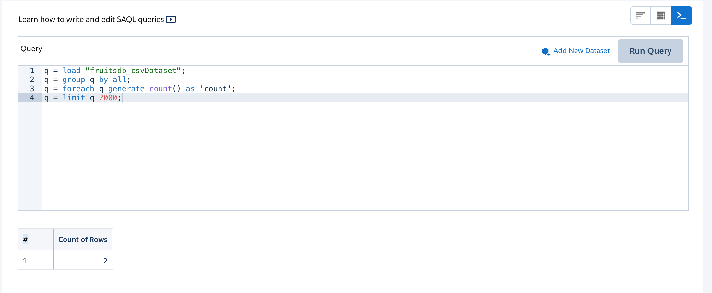
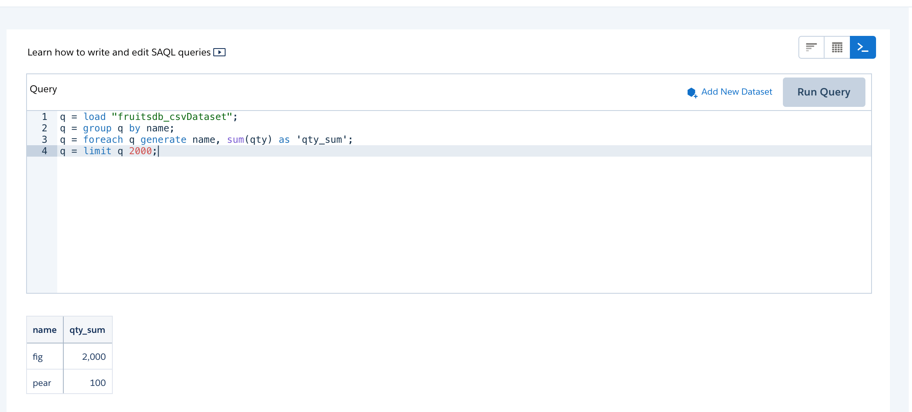

# How to execute run SAQL in Apex using Analytics Apex SDK

## Topics

- [Execute one query](#q1)
- [Execute 2 queries](#q2)
- [References](#ref)

<a name='q1'></a>
### Create apex code file for this lens

```
$ cat ~/.ea/fruits.cls
```

```java
 Wave.ProjectionNode[] projs = new Wave.ProjectionNode[]{
        Wave.QueryBuilder.count().alias('count')
};
    
ConnectApi.LiteralJson result = Wave.QueryBuilder.load('0Fb3h0000005ZoNCAU', '0Fc3h000002yVYPCA2')
    .group(new String[]{'all'})
    .foreach(projs)
    .execute('q');
String response = result.json;
System.debug(result.json);

```

- Note the result will be written to the debug log

### Run it

```
$ sfdx mohanc:tooling:execute  -u mohan.chinnappan.n_ea2@gmail.com  -a ~/.ea/fruits.cls 
apexCode: Wave.ProjectionNode[] projs = new Wave.ProjectionNode[]{
        Wave.QueryBuilder.count().alias('count')
};
    
ConnectApi.LiteralJson result = Wave.QueryBuilder.load('0Fb3h0000005ZoNCAU', '0Fc3h000002yVYPCA2')
    .group(new String[]{'all'})
    .foreach(projs)
    .execute('q');
String response = result.json;
System.debug(result.json);

compiled?: true
executed?: true
{
  line: -1,
  column: -1,
  compiled: true,
  success: true,
  compileProblem: null,
  exceptionStackTrace: null,
  exceptionMessage: null
}

```

<a name='q2'></a>
## Let us execute 2 queries with query for this lens as well

### Apex code
```   
$ cat ~/.ea/fruits2.cls
Wave.ProjectionNode[] projs = new Wave.ProjectionNode[]{
        Wave.QueryBuilder.count().alias('count')
};
    
ConnectApi.LiteralJson result = Wave.QueryBuilder.load('0Fb3h0000005ZoNCAU', '0Fc3h000002yVYPCA2')
    .group(new String[]{'all'})
    .foreach(projs)
    .execute('q');
String response = result.json;
System.debug(result.json);

 


//==========
Wave.ProjectionNode[] projs2 = new Wave.ProjectionNode[]{
        Wave.QueryBuilder.get('qty').sum().alias('qty_sum')                                  
};
    
    
ConnectApi.LiteralJson result2 = Wave.QueryBuilder.load('0Fb3h0000005ZoNCAU', '0Fc3h000002yVYPCA2')
    .group(new String[]{'name'})
    .foreach(projs2)
    .execute('q');
String response2 = result2.json;
System.debug(result2.json);

// If you excecute both queries, you will get
// Error: System.CalloutException: You have uncommitted work pending. Please commit or rollback before calling out
```

### Run it
```
$ sfdx mohanc:tooling:execute  -u mohan.chinnappan.n_ea2@gmail.com  -a ~/.ea/fruits2.cls 
apexCode: Wave.ProjectionNode[] projs = new Wave.ProjectionNode[]{
        Wave.QueryBuilder.count().alias('count')
};
    
ConnectApi.LiteralJson result = Wave.QueryBuilder.load('0Fb3h0000005ZoNCAU', '0Fc3h000002yVYPCA2')
    .group(new String[]{'all'})
    .foreach(projs)
    .execute('q');
String response = result.json;
System.debug(result.json);


//==========
Wave.ProjectionNode[] projs2 = new Wave.ProjectionNode[]{
        Wave.QueryBuilder.get('qty').sum().alias('qty_sum')                                  
};
    
    
ConnectApi.LiteralJson result2 = Wave.QueryBuilder.load('0Fb3h0000005ZoNCAU', '0Fc3h000002yVYPCA2')
    .group(new String[]{'name'})
    .foreach(projs2)
    .execute('q');
String response2 = result2.json;
System.debug(result2.json);

// If you excecute both queries, you will get
// Error: System.CalloutException: You have uncommitted work pending. Please commit or rollback before calling out

compiled?: true
executed?: false
{
  line: 28,
  column: 1,
  compiled: true,
  success: false,
  compileProblem: null,
  exceptionStackTrace: 'Class.ConnectApi.Wave.executeQuery: line 28, column 1\n' +
    'Class.Wave.QueryNode.execute: line 95, column 1\n' +
    'AnonymousBlock: line 24, column 1\n' +
    'AnonymousBlock: line 24, column 1',
  exceptionMessage: 'System.CalloutException: You have uncommitted work pending. Please commit or rollback before calling out'
}
```


### Looking at the logs
```
$ sfdx mohanc:data:query -u mohan.chinnappan.n_ea2@gmail.com -q ~/.ea/apexlog.soql 
"attributes","Id"
"{""type"":""ApexLog"",""url"":""/services/data/v49.0/sobjects/ApexLog/07L3h000003ZqnVEAS""}","07L3h000003ZqnVEAS"
"{""type"":""ApexLog"",""url"":""/services/data/v49.0/sobjects/ApexLog/07L3h000003ZozoEAC""}","07L3h000003ZozoEAC"
"{""type"":""ApexLog"",""url"":""/services/data/v49.0/sobjects/ApexLog/07L3h000003ZozjEAC""}","07L3h000003ZozjEAC"
"{""type"":""ApexLog"",""url"":""/services/data/v49.0/sobjects/ApexLog/07L3h000003ZozUEAS""}","07L3h000003ZozUEAS"
"{""type"":""ApexLog"",""url"":""/services/data/v49.0/sobjects/ApexLog/07L3h000003Zoz5EAC""}","07L3h000003Zoz5EAC"
"{""type"":""ApexLog"",""url"":""/services/data/v49.0/sobjects/ApexLog/07L3h000003ZoujEAC""}","07L3h000003ZoujEAC"
"{""type"":""ApexLog"",""url"":""/services/data/v49.0/sobjects/ApexLog/07L3h000003ZomnEAC""}","07L3h000003ZomnEAC"
"{""type"":""ApexLog"",""url"":""/services/data/v49.0/sobjects/ApexLog/07L3h000003ZoAiEAK""}","07L3h000003ZoAiEAK"
"{""type"":""ApexLog"",""url"":""/services/data/v49.0/sobjects/ApexLog/07L3h000003ZoTpEAK""}","07L3h000003ZoTpEAK"
"{""type"":""ApexLog"",""url"":""/services/data/v49.0/sobjects/ApexLog/07L3h000003ZoUqEAK""}","07L3h000003ZoUqEAK"
```
```
$ cat ~/.ea/apexlog.soql
```
```sql
SELECT id FROM ApexLog
   ORDER BY LastModifiedDate DESC
```

```
$ sfdx mohanc:ws:rest -m GET -r https://mohansun-ea-02-dev-ed.my.salesforce.com/services/data/v49.0/tooling/sobjects/ApexLog/07L3h000003ZqnVEAS -f header.json 
```
```json
{
    "attributes": {
        "type": "ApexLog",
        "url": "/services/data/v49.0/tooling/sobjects/ApexLog/07L3h000003ZqnVEAS"
    },
    "Id": "07L3h000003ZqnVEAS",
    "LogUserId": "0053h000002xQ5sAAE",
    "LogLength": 10152,
    "LastModifiedDate": "2020-09-25T16:14:33.000+0000",
    "Request": "Api",
    "Operation": "/services/data/v49.0/tooling/executeAnonymous/",
    "Application": "Unknown",
    "Status": "You have uncommitted work pending. Please commit or rollback before calling out", <==============
    "DurationMilliseconds": 340,
    "SystemModstamp": "2020-09-25T16:14:33.000+0000",
    "StartTime": "2020-09-25T16:14:33.000+0000",
    "Location": "SystemLog",
    "RequestIdentifier": "4YVHv2wIPAJUzfX2-pk0Z-"
}
```
<a name='ref'></a>
## References
- [Analytics SDK Developer Guide](https://developer.salesforce.com/docs/atlas.en-us.bi_dev_guide_sdk.meta/bi_dev_guide_sdk/bi_sdk_apex.htm)

